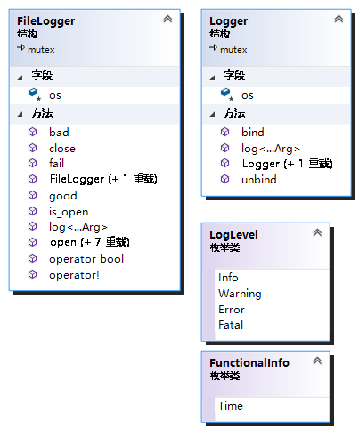

# logger


测试代码输出日志

```
2020-6-11 09:24:44  [INFO] This is ofstream logger.
2020-6-11 09:24:44  [INFO] This is ofstream logger (g).
2020-6-11 09:24:44  [INFO] This is ofstream logger -- again.
2020-6-11 09:24:44  [INFO] This is ofstream logger -- again again.
2020-6-11 09:24:44  [INFO] This is ofstream logger &&.
2020-6-11 09:24:44  [INFO] This is file logger.
2020-6-11 09:24:44  [INFO] This is file logger (g).
2020-6-11 09:24:44  [INFO] This is file logger &&.
```

## 类图



`FileLogger`主要用于向日志文件输出

`Logger`主要用于向流输出

`LogLevel`定义了四种日志级别

`FunctionalInfo`定义了功能性的信息，这里只做了时间的插入

## 测试部分

### Logger


```cpp
std::ofstream ofs("log.txt", std::ios::app);
thatboy::logger::Logger logger(ofs);
logger.log(thatboy::logger::LogLevel::Info, "This is ofstream logger.");
thatboy::logger::log(logger, thatboy::logger::LogLevel::Info, "This is ofstream logger (g).");
ofs.close();
logger.log(thatboy::logger::LogLevel::Info, "THIS WON'T BE WRITTEN.");
ofs.open("log.txt", std::ios::app);
logger.log(thatboy::logger::LogLevel::Info, "This is ofstream logger -- again.");
ofs.close();

std::ofstream ofs2("log.txt", std::ios::app);
logger.bind(ofs2);
logger.log(thatboy::logger::LogLevel::Info, "This is ofstream logger -- again again.");
ofs2.close();
logger.unbind();
logger.log(thatboy::logger::LogLevel::Info, "THIS WON'T BE WRITTEN.");

std::ofstream ofs3("log.txt", std::ios::app);
thatboy::logger::log(thatboy::logger::Logger(ofs3), thatboy::logger::LogLevel::Info, "This is ofstream logger &&.");
```

### FileLogger

```cpp
thatboy::logger::FileLogger filelogger("log.txt");
filelogger.log(thatboy::logger::LogLevel::Info, "This is file logger.");
thatboy::logger::log(filelogger, thatboy::logger::LogLevel::Info, "This is file logger (g).");
filelogger.close();
filelogger.log(thatboy::logger::LogLevel::Info, "THIS WON'T BE WRITTEN.");

thatboy::logger::log(thatboy::logger::FileLogger("log.txt"), thatboy::logger::LogLevel::Info, "This is file logger &&.");
```

